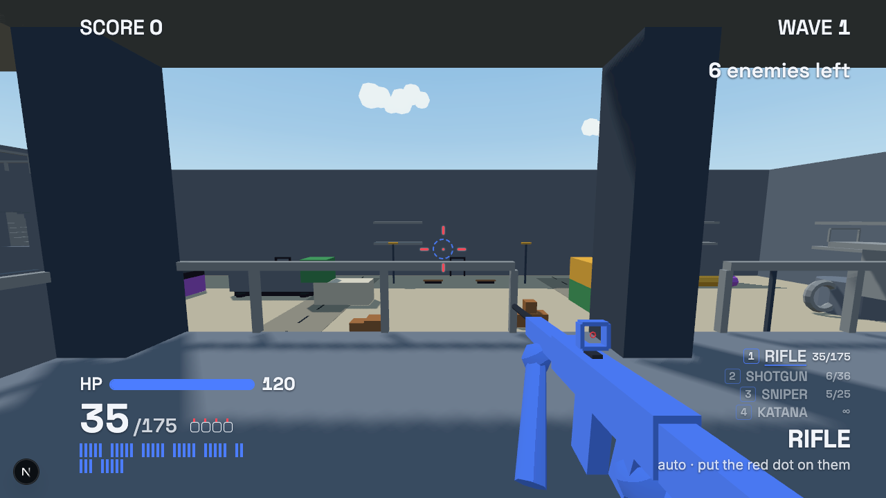
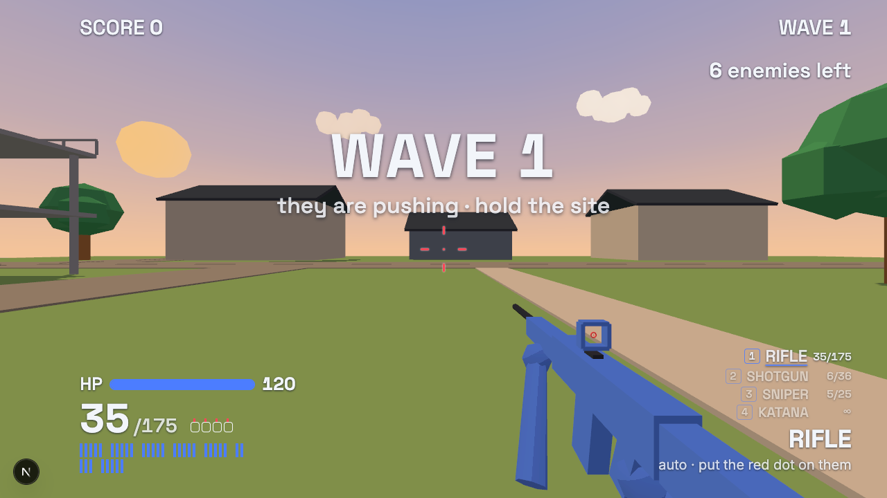
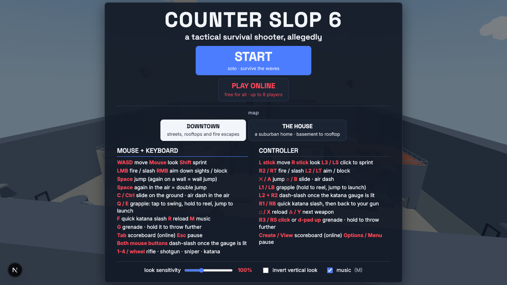

# Counter Slop 6

A tactical survival shooter, allegedly. Runs in the browser, no install.

**Play:** https://counter-slop-6.vercel.app







## What it is

- Solo wave survival, or free-for-all online for up to 8 players (peer-to-peer, no server).
- Two maps: **Downtown** (streets, rooftops, fire escapes) and **The House** (a suburban home, basement to rooftop).
- Rifle, shotgun, sniper, katana. Grenades. Grapple, slide, wall jump, double jump, air dash.
- Enemies lead their shots, take cover between bursts, fan out and dodge grenades.
- Mouse + keyboard or controller.

## Controls

| Action | Keyboard / mouse | Controller |
| --- | --- | --- |
| Move / look / sprint | WASD / mouse / Shift | L stick / R stick / L3 |
| Fire / aim | LMB / RMB | R2 / L2 |
| Jump, wall jump, double jump | Space | ✕ / A |
| Slide / air dash | C or Ctrl | ○ / B |
| Grapple | Q or E | L1 / LB |
| Katana slash | F | R1 / RB |
| Grenade (hold to throw further) | G | R3 or d-pad up |
| Reload / weapons | R / 1-4 or wheel | □ / △ |
| Scoreboard / pause | Tab / Esc | View / Menu |

## Run it locally

```sh
npm install
npm run dev        # http://localhost:3000
```

```sh
npm run typecheck && npm test   # tsc + vitest
npm run build                   # static export to out/
npm run smoke                   # boots the engine in headless Chromium against a running dev server
```

Next.js, React, TypeScript, three.js, PeerJS. Design docs in [`docs/`](docs/ARCHITECTURE.md).
